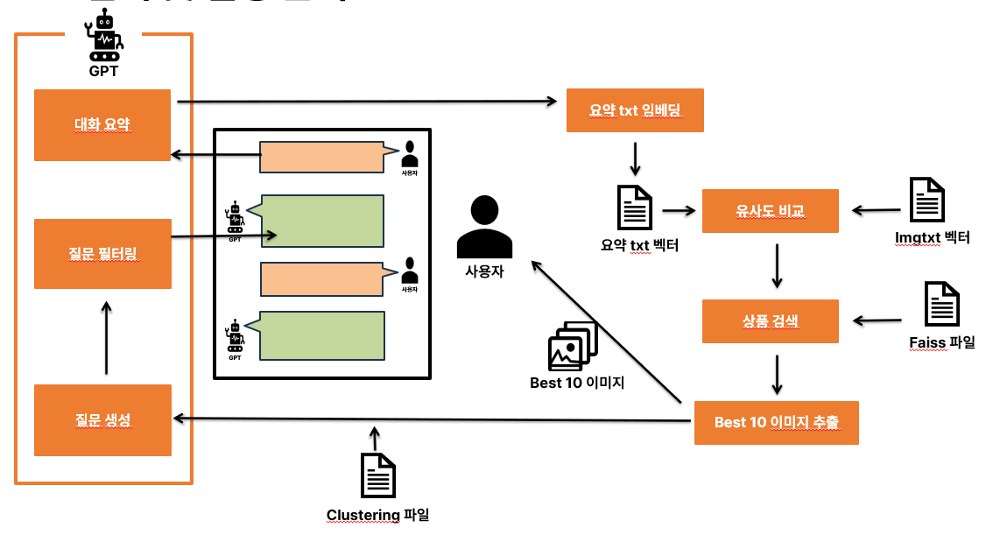

# PlugIR-Inspired CLIP-based Interactive Product Search

이 프로젝트는 OpenCLIP 기반 멀티모달 임베딩, FAISS 기반 이미지 검색, 그리고 PlugIR 방식의 GPT 기반 질의 리포밍 구조를 결합하여 구현된 대화형 상품 검색 시스템입니다.  
Streamlit UI를 통해 사용자는 자연어로 질문을 입력하고, GPT 기반 요약 → 질문 생성 → 질문 필터링 과정을 거쳐 적절한 상품 이미지를 검색할 수 있습니다.

---

## 핵심 구성 요소

| 구성 요소            | 설명 |
|---------------------|------|
| CLIP 임베딩         | OpenCLIP (ViT-H/14, laion2b_s32b_b79k) 사용 |
| FAISS 검색          | 이미지/텍스트 임베딩을 기반으로 유사도 검색 수행 |
| KMeans 클러스터링   | 유사 이미지 군집화 및 GPT 질문 생성을 위한 context로 활용 |
| GPT 질문 리포밍     | PlugIR 구조 기반으로 요약 → 질문 생성 → 필터링 |
| Streamlit UI        | 사용자 입력 → 이미지 검색 결과 시각화 + 후속 질문 생성 |

---

## 사용 기술

- OpenCLIP for multimodal (image + text) embedding
- FAISS for fast similarity search
- KMeans clustering (13개 cluster 고정)
- OpenAI GPT API for summarization and question generation
- Streamlit for web UI
- torch, PIL, tqdm, scikit-learn, json

---

## 주요 파일 구조

```
├── clust_faiss_img_embed.py           # 이미지 단독 임베딩 + FAISS + KMeans 클러스터링
├── clust_faiss_imgtxt_embed.py        # 이미지 + 텍스트 멀티모달 임베딩 + FAISS + KMeans
├── faiss_clip_cluster_prompt.py       # Streamlit UI + GPT 기반 질문 생성 및 검색 결과 출력
├── data/                              # 이미지(.jpg, .png) + 설명 텍스트(.txt)
├── embedding/                         # 저장된 임베딩(.pth), 인덱스(.index), 클러스터 결과(.json)
└── README.md
```
## 시스템 구조도

아래 다이어그램은 PlugIR 구조 기반의 대화형 멀티모달 상품 검색 시스템의 전체 흐름을 보여줍니다.



---

## 데모 화면

Streamlit 기반의 실제 데모 UI입니다.  
사용자가 자연어로 질문하면 요약 → 질문 생성 → 이미지 검색 → 후속 질문이 자동으로 수행됩니다.


